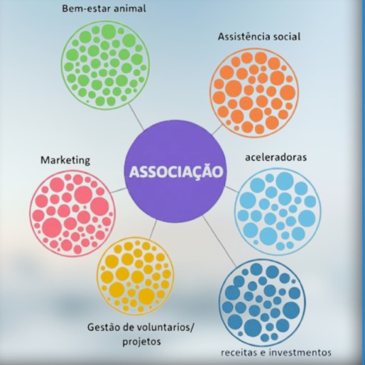
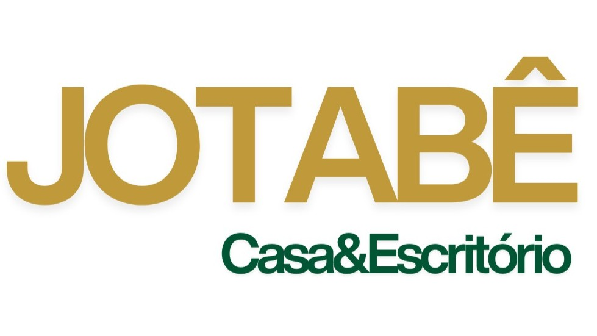
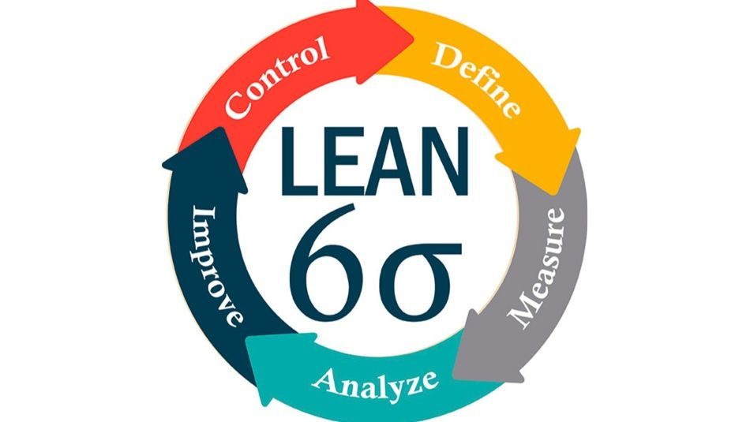
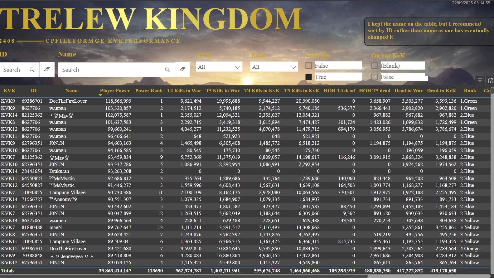
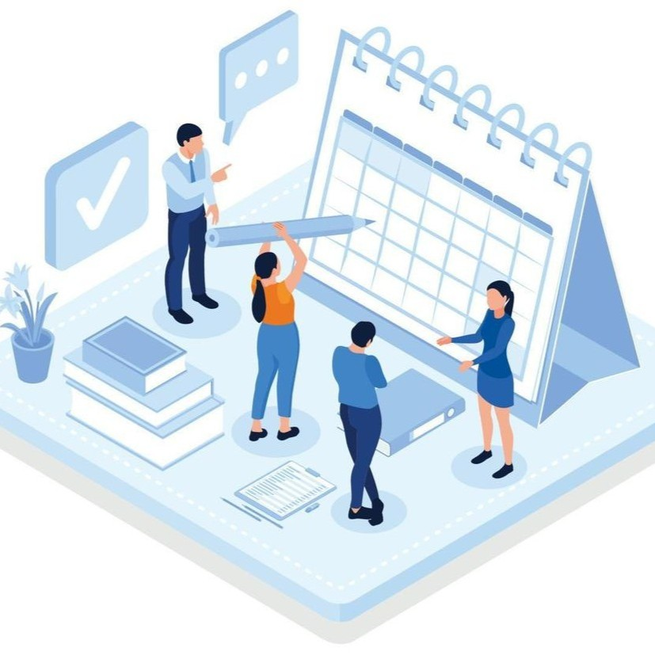

    

# 👨‍💻About Me

**TODOS**

<!--
- [ ] Maybe reframe the About me section (ex: About me | What i do | my passion etc) 

- [ ] Update the repos and add to highlights

  - [ ] Ampara Data analysis

  - [ ] Notion page

- [ ] Update the repos and add to Others

  - [ ] Awards and achievements
  - [ ] File Password Manager

- [ ] Maybe remove Others from this main page and give it a special page, as well more details about me in a specific page]
  -->

I specialize in **transforming operational complexity into scalable systems.**

My work sits at the intersection of **Process Optimization, Data Analysis & Engineering, and Social Strategy**. I leverage a multidisciplinary stack to design robust solutions that empower organizations to move from reactive firefighting to structured, data-driven decision-making.

I am eager to apply these engineering principles primarily to **socially impactful environments**, including philanthropic organizations and animal welfare networks, where operational efficiency directly translates into real-world results.

**Core Philosophy:**

> **"Reliability is not accidental — it is engineered."**  
> 
> I strive to combine **Engineering** rigor with **Systemic Thinking** (Society 5.0) to translate subjective intuition into measurable, resilient processes. 
> 
> **My goal is to build the infrastructure that allows empathy to scale.**

  

  

---

  <h2>🛠️Technical Arsenal</h2>
   
  <!-- Engineering (Blue Theme) -->
    
  
  
  
  
    
<!-- Data & Analytics (Purple Theme) -->
    
  
  
  
  
    
<!-- Strategy (Orange Theme) -->
    
  
  
  
    
<!-- Domain & Impact (Green Theme) -->
    
  
  
  
    
<!-- Tools (Red Theme) -->
    
  
  
  
  
  
  

***

# 🔆Work in progress

<table>
<!--Description up to 6 lines-->
  <tr>
    <td width="300">
      
    </td>
    <td valign="top">
      <h2><a href="https://github.com/GabrielOlC/BLUEPRINT-FOR-NGO-IMPACT_Pre-Publication-Abstract" target="_blank" rel="noopener noreferrer">Bluprint FOR NGO Impact</a></h2>
      

I am currently developing a strategic framework to strengthen the Third Sector through a Collaborative Ecosystem Model, using animal welfare as the pilot case to design scalable, intersectional solutions. Grounded in scientific research, this initiative replaces fragmented efforts with distributed competencies inspired by Holacracy and Society 5.0, enabling NGOs to share specialized expertise and optimize resources. Anchored in data-driven Dog Population Management, One Health principles, and diversified revenue models, the framework aims to build a self-managed, resilient ecosystem that amplifies collective impact and reduces single source dependencies.
      

    </td>
  </tr>
</table>

# ✨Project Highlights

<table>
<!--
- descriptions up to 3 lines
- Imgs 16:9
-->
  <tr><tr><!--Empty to trigger git background-->
  <tr>
    <td width="450" valign="top">
      

         
        <h3><a href="https://github.com/GabrielOlC/JB-Ecommerce-ERP-Solutions" target="_blank">Enterprise Resource Planning & Management</a></h3>
      

      

A tailored suite of ERPM tools designed to streamline operations, enhance accuracy, and boost profitability for an e-commerce startup. Built with MS Excel, VBA, Power Query (M), and Access, these automation-driven solutions optimize pricing, order processing, and financial reconciliation—empowering a small team to efficiently scale business.
      

    </td>
    <td width="450" valign="top">
      

         
        <h3><a href="https://github.com/GabrielOlC/L6S-Manufacturing-Optimization" target="_blank">Lean Six Sigma Process Optimization (DMAIC)</a></h3>
      

      

Decoded and optimized undocumented manufacturing machinery, achieving a 90% waste reduction and a 150% productivity increase. Through systematic process analysis, reverse‑engineering, and optimization, the project transformed unreliable operations into a stable, efficient system with sustainable SOPs and long‑term reliability
      

    </td>
    <td width="450" valign="top">
      

         
       <h3><a href="https://github.com/GabrielOlC/Game-Data-Analytics-Engine" target="_blank">Game Data Analytics Engine (ROK)</a></h3>
      

      

An advanced tool for managing and analyzing Rise of Kingdoms KvK player performance data. Built with Power Query, AD Excel formulas, and VBA, it automates data processing, score calculations, and contribution points—helping kingdoms optimize governance, evaluations, and reward distribution.
      

    </td>
  </tr>
  <tr><tr><!--Empty to trigger git background-->
</table>

# Other projects

<table>
<!--Description up to 2 lines-->
  <tr>
    <td width="200" >
      
    </td>
    <td valign="top">
      <h2><a href="https://github.com/GabrielOlC/Dev-Patterns-and-Snippets" target="_blank" rel="noopener noreferrer">Architecture Standards & Snippet Library</a></h2>
      

 A centralized library establishing strict naming conventions, architectural principles (Object Calisthenics), and reusable code snippets (e.g., VBA, M, Python). It ensures that every project I build is modular, maintainable, and scalable from Day 1.
      

    </td>
  </tr>
</table>

<table>
<!--Description up to 2 lines-->
  <tr>
    <td width="200" >
      
    </td>
    <td valign="top">
      <h2><a href="https://github.com/GabrielOlC/NGO-Campaign-Scheduler" target="_blank" rel="noopener noreferrer">NGO Campaign & events Scheduler</a></h2>
      

A VBA-based application to manage high-volume scheduling for animal welfare campaigns, featuring automated slot generation and dynamic communication.
      

    </td>
  </tr>
</table>
